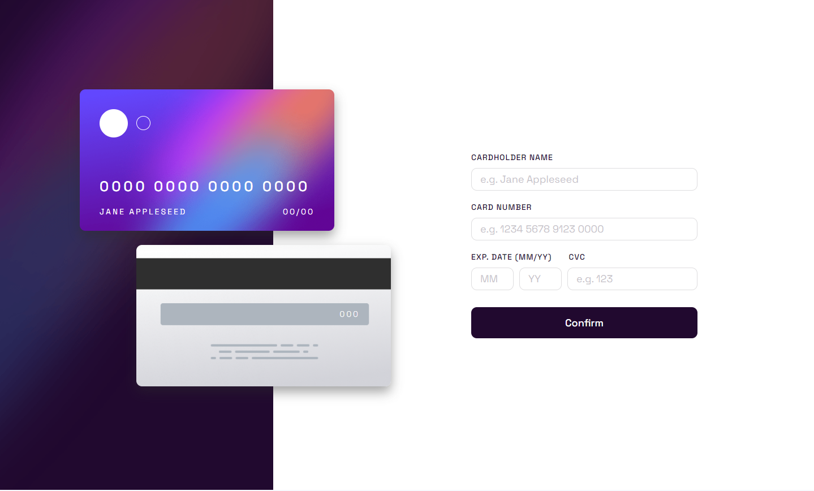
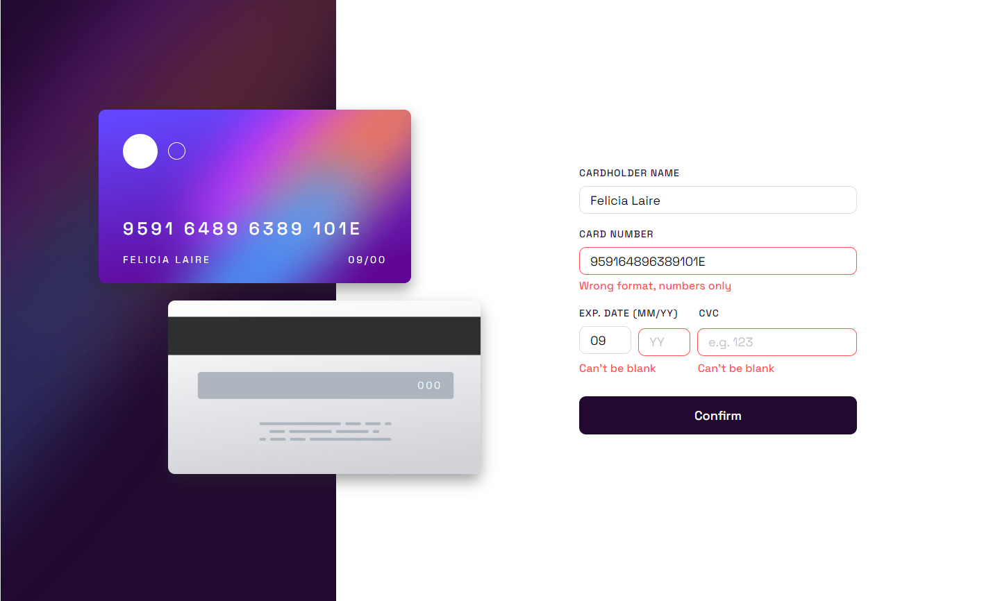
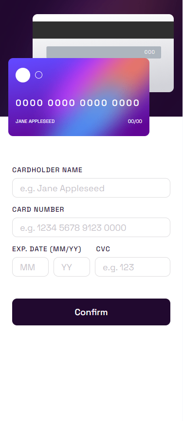
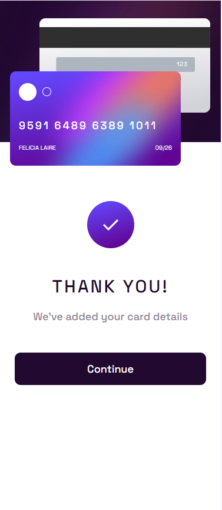

# Frontend Mentor - Interactive card details form solution

This is a solution to the [Interactive card details form challenge on Frontend Mentor](https://www.frontendmentor.io/challenges/interactive-card-details-form-XpS8cKZDWw). Frontend Mentor challenges help you improve your coding skills by building realistic projects. 

## Table of contents

- [Overview](#overview)
  - [The challenge](#the-challenge)
  - [Screenshot](#screenshot)
  - [Links](#links)
- [My process](#my-process)
  - [Built with](#built-with)
  - [What I learned](#what-i-learned)
  - [Continued development](#continued-development)
- [Author](#author)

## Overview

### The challenge

Users should be able to:

- Fill in the form and see the card details update in real-time
- Receive error messages when the form is submitted if:
  - Any input field is empty
  - The card number, expiry date, or CVC fields are in the wrong format
- View the optimal layout depending on their device's screen size
- See hover, active, and focus states for interactive elements on the page

### Screenshot

## Desktop Design

## Mobile Design

### Links

- Live Site URL: [Not a Real Card](https://your-live-site-url.com)

## My process

### Built with

- Semantic HTML5 markup
- CSS custom properties
- Flexbox
- CSS Grid
- Mobile-first workflow
- [React](https://reactjs.org/) - JS library

### What I learned

To be honest, this project was pretty brutal. I had so many problems trying to make the card number work correctly, since I wanted to make sure the user didn't include any white space in their input, as well as preventing them from entering in a card number less than the desire length or one that had letters in it. There was a bunch of studying on Regex that I had to do, go down several rabbit holes on making different formats for different card types, and I just decided to dumb it down a lot and make it only accept the standard VISA/MasterCard format. 

I also had a big problem with the error states not clearing when the user would press the confirm button, as it would take 2 clicks instead of 1 when an error was showing. I'm still not entirely sure how to fix this, because React handles state management asychronously and I couldn't find a way to make it so the user would only have to click confirm once when an error was showing. The only workaround I found for this was calling the validation functions twice, once to clear the errors and once to validate the forms. If anyone with good React experience stumbles across this project, please help me out with this!

### Continued development

Would love to do this again with better React knowledge, but don't have any plans to come back to this project anytime soon.

## Author

- Frontend Mentor - [@rkendall300](https://www.frontendmentor.io/profile/rkendall300)
